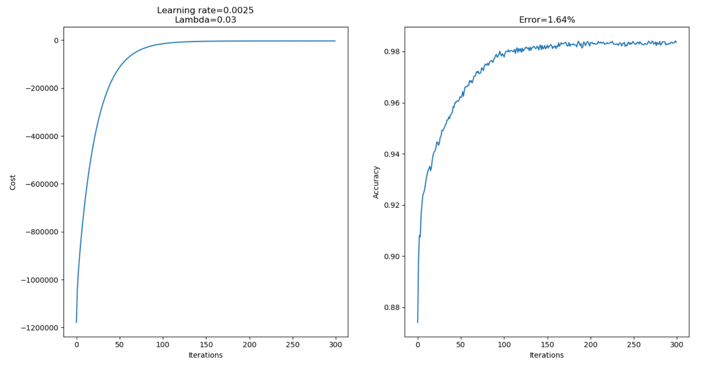

# Neural Network
Implementation of a neural network from scratch (using NumPy) with one hidden layer. Softplus, Hyperbolic Tangent and Cosine activation functions are available. Part of my 8th semester Machine Learning course project.

## Example Learning Curves
Below are some example learning curves when trained on the MNIST handwritten digit dataset. The tanh activation is used and the hidden layer has 300 nodes trained 
with minibatch size = 200.

.
